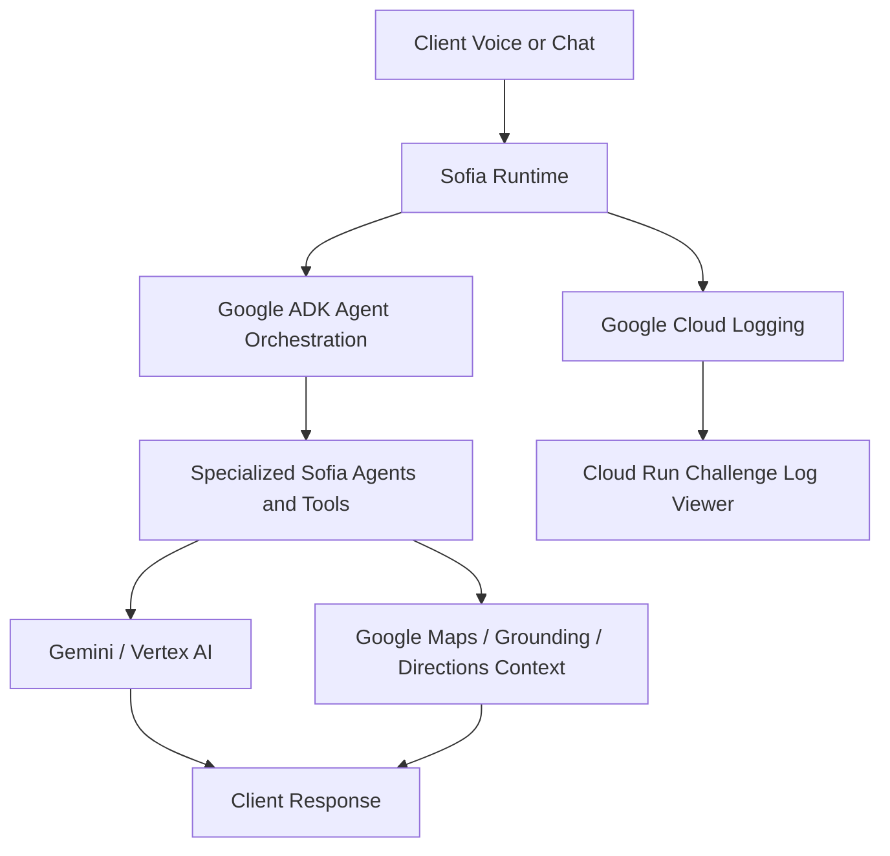

# Conecta Sofia Call Startup Challenge

This folder contains an isolated Cloud Run demo surface for the Google for Startups AI Agents Challenge video.

## What This Is

`startup-challenge.html` is a standalone browser page that shows real, sanitized Cloud Logging evidence for the Sofia challenge workflow. It is a judge-facing activity view for ADK, Gemini, Maps, grounding, and directions evidence.

This is not a production Conecta feature.

## How To Open It

Open the hosted Cloud Run page:

```text
https://conecta-sofia-call-startup-challenge-34813533134.us-east1.run.app/
```

No localhost server, production app login, production route, database migration, or Conecta navigation is required.

## What The Video Should Show

1. Open the Cloud Run URL on the recording monitor.
2. Trigger the real Sofia / ADK flow in the other browser or system.
3. Click `Start Watching Logs`.
4. Record real log cards as they appear with received time, Google product, agent/tool, and summary.
5. Click `Stop Watching Logs` when the recording segment is done.

## Google Tools Represented

- Google ADK: agent routing and workflow orchestration evidence.
- Google Maps: grounding, directions, route, street, or landmark evidence.
- Gemini / Vertex AI: response generation evidence.
- Google Cloud / Cloud Run: hosted challenge surface and log source.

## Challenge Alignment

Recommended track: Track 2, Optimize Existing Agents.

Conecta Sofia is an existing business assistant for tax offices and service businesses. This challenge package focuses on proving the real runtime path: Sofia receives a client interaction, routes work through the agent layer, uses Google tooling for intelligence and grounding, and exposes clean evidence for judges without requiring production app access.

Business problem: bilingual tax-office clients need fast help for practical workflows such as directions, appointment questions, document reminders, and follow-up. Sofia reduces repetitive front-desk work while improving Spanish and English client access.

Technologies used:

- Google Cloud Run for the hosted challenge page and `/logs` endpoint.
- Google Cloud Logging as the evidence source for real Sofia runtime events.
- Gemini / Vertex AI for response generation evidence.
- Google ADK for orchestration evidence in the supporting source files.
- Google Maps, grounding, or directions evidence when emitted by the live agent flow.

Architecture:



Data sources and grounding:

- Live Sofia runtime logs from Cloud Logging.
- ADK, Gemini, Maps, grounding, and directions events emitted by the backend.
- Sanitization removes obvious emails, phone numbers, bearer tokens, API keys, secrets, and passwords before display.

Testing instructions:

1. Open `https://conecta-sofia-call-startup-challenge-34813533134.us-east1.run.app/`.
2. Call Sofia at `(619) 826-8955` or trigger the real Sofia flow from another channel.
3. Click `Start Watching Logs`.
4. Confirm real log cards appear with received time, product label, source, and summary.
5. Click `Stop Watching Logs` to stop polling without clearing visible evidence.
6. Click `Clear Logs` to reset the visible activity feed.

Findings and learnings:

- Judges need clean proof of agent behavior, not raw noisy transport logs.
- Real-time Cloud Logging evidence is safer for review than wiring a demo page into production navigation.
- The clearest demo is short: show the business problem, trigger Sofia, then show ADK/Gemini/Maps evidence in the hosted activity view.

## Live Vs Demo-Safe Proof

The page does not simulate workflow proof. `Start Watching Logs` calls the challenge-only `/logs` endpoint on this Cloud Run service. That endpoint reads recent Cloud Logging entries from `conecta-proxy-prod`, filters noisy voice/Infobip transport logs out of the page, and shows only concise human-readable evidence relevant to Google ADK, Gemini, Maps, grounding, or directions.

If no matching entries exist in the current freshness window, the panel stays empty until matching real logs arrive.

## Runtime Files

- `startup-challenge.html`: browser UI.
- `live-log-bridge.mjs`: Cloud Run server and `/logs` endpoint.
- `package.json`: Node start command for Cloud Run.
- `.gcloudignore`: deploy ignore file.

## Isolation Guarantee

This folder is intentionally standalone:

- It does not touch production UI routes.
- It does not modify existing Conecta workflows.
- It does not change database schema.
- It does not create migrations.
- It does not wire into real app navigation.
